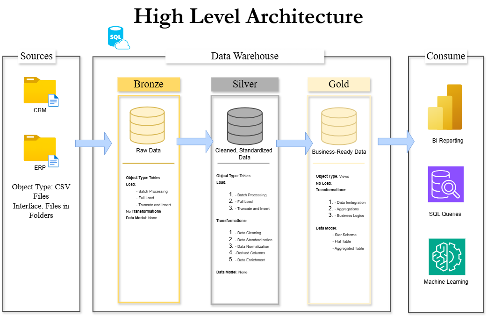

# 🏗️ Data Analytics Project 

## 🚀 Overview

This project implements a **modern Data Warehouse** on **SQL Server**, leveraging the **Medallion Architecture (Bronze → Silver → Gold)** to transform raw sales data into clean, reliable, and analytics-ready datasets.

---

## 🎯 Objectives

- Ingest structured CSV data from **CRM** and **ERP** source systems.
- Clean, transform, and integrate raw data across multiple layers.
- Create a robust, user-friendly data model for **analytics**, **visualization**, and **reporting**.
- Deliver actionable business insights on **Customers**, **Products**, and **Sales Trends**.

---

## 🗂️ Data Architecture

### 🔰 Bronze Layer: Raw Ingestion

- Stores raw, unmodified data from source CSVs.
- One-to-one mapping with the original source tables.
- **Naming Convention:** `<source>_<entity>` (e.g., `crm_customer_info`)

### ⚙️ Silver Layer: Transformation & Cleansing

- Cleansed and standardized data.
- Retains original structure but resolved data quality issues.
- **Naming Convention:** `<source>_<entity>`

### 🥇 Gold Layer: Business-Ready Data

- Contains business-aligned, analytical models.
- Supports dashboards, KPIs, and reports.
- **Naming Convention:**
  - Dimensions: `dim_<entity>` (e.g., `dim_customers`)
  - Facts: `fact_<entity>` (e.g., `fact_sales`)

 
---

## 🛠️ Data Pipeline

### 📥 Data Sources

- **Folder 1 (CRM)**  
  `cust_info.csv`, `prd_info.csv`, `sales_details.csv`

- **Folder 2 (ERP)**  
  `cust_az12.csv`, `loc_a101.csv`, `px_cat_g1v2.csv`

### 📌 Stored Procedures

- `load_bronze` → Loads raw CSV data into the Bronze Layer.  
- `load_silver` → Transforms and cleanses Bronze data into the Silver Layer.  
- `load_gold` → Builds business-ready models in the Gold Layer.  

---

## 📏 Standards & Conventions

### ✅ General

- **Language**: English  
- **Naming Style**: `snake_case`  
- **Avoid Reserved Words**: No use of SQL reserved keywords.

### 📊 Tables

| Layer   | Format                   | Example               |
|---------|--------------------------|------------------------|
| Bronze  | `<source>_<entity>`      | `crm_sales_details`    |
| Silver  | `<source>_<entity>`      | `erp_px_cat_g1v2`      |
| Gold    | `dim_<entity>`, `fact_<entity>` | `dim_products`, `fact_sales` |

### 🔑 Column Naming

- **Surrogate Keys**: `<table_name>_key`  
  _Example_: `customer_key`

- **Technical Columns**: `dwh_<column_name>`  
  _Example_: `dwh_load_date`

---

## 📊 BI & Reporting Focus

Delivering powerful insights into:

- **Customer Behavior**
- **Product Performance**
- **Sales Trends**

These insights help stakeholders make **data-driven decisions**.

---

## 🙋‍♂️ About Me

Hi! I’m **Kanishka Maurya**, a data analytics enthusiast passionate about building efficient ETL pipelines and analytics-ready data warehouses.

📫 Email: kanishkamauryaofficial@gmail.com  

> “Data is a precious thing and will last longer than the systems themselves.” – *Tim Berners-Lee*

---

